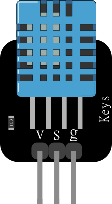

# DHT11-module-fritzing-part
--------

這是一個DHT11模組的fritzing part

你可以自由使用這個fritzing part
本物件參考
[參考模組](https://github.com/adafruit/Fritzing-Library/blob/master/parts/DHT11%20Humitidy%20and%20Temperature%20Sensor.fzpz)
下去修改成模組圖樣

------
請注意本圖示pcb部分並無準確測量如需輸出pcb請用官方文件下去修改
[官方文件](https://www.mouser.com/ds/2/737/dht-932870.pdf) 